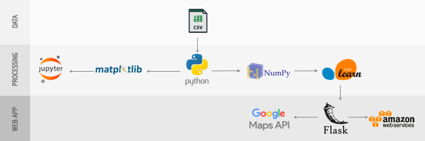

# Flip Risk Indexer

Emily Gill

Galvanize Data Science Immersive - January 2018

[FlipRiskIndexer.com](http://www.flipriskindexer.com)

## Table of Contents
1. [Background](#background)
2. [Web Application](#web-application)
3. [Data Collection and Cleaning](#data-collection-and-cleaning)
4. [Technologies Used](#technologies-used)
5. [Flip Risk Indexer](#flip-risk-indexer)
6. [Future Steps](#future-steps)
7. [Repo Structure](#repo-structure)

## Background

[Privy](http://www.getprivynow.com/) is a real estate investment software that finds and analyzes deals fast. It informs agents of where investors are doing deals and it allows investors to make deals without needing an agent. In the world of Privy, investments come in three categories: fix 'n flips, pop-tops, and total tear downs.

In a market like Denver's, investment opportunities are everywhere, but also highly sought after. Investors need to act fast on open listings. FlipRiskIndexer helps investors and agents representing investors to:
- identify hot zones for investment in Denver metro area,
- help investors visualize how hot zones have been shifting, and
- use hot zones along with property attributes from past investment opportunities
to develop a Flip Risk Indexer for houses currently on the market.

## Web Application

I created an app called FlipRiskIndexer using Flask and self-hosted it on AWS.

[screenshot of home page]

FlipRiskIndexer asks the user to input the type of investment they are interested in undertaking, along with their renovation budget. On the backend, a Random Forest Regression model predicts the potential listing price of that property post-renovations. Using the differential between the predicted value of the flipped home and the original listing price, along with your given renovation budget, FlipRiskIndexer categorizes flips as black (safe), grey (eh?) and red (walk away!). It also provides the user with information about the Top 20 potential investment properties and potential earnings for the Metro Denver area.

[screenshot of prediction page]

FlipRiskIndexer also provides heat maps that show where the hottest investment zone in Denver are right now and where they have been in the past.

[screenshot of heatmap page]

## Data Collection and Cleaning

The data provided by Privy are MLS (Multiple Listing Services) real estate listings for Denver since 2008 as a .csv with over 500K rows of current and previous real estate listings. This .csv had about 55 columns of data, some of which were very long text fields that delimited incorrectly. I used the csv package to read the data in line by line to identify inconsistencies and fix them on the fly, writing each clean line to a new .csv file. The clean MLS .csv could then be read in as a pandas dataframe for pre-processing.

A second .csv provided by Privy identified investment purchases in Denver. Investment purchases are categorized as one of the following three deal types:
- **fix 'n flips** - when an investor guts the inside of a house and renovates. These are ID'd in the MLS as a property that was bought and then resold in a relatively short period of time with a price increase
- **pop-tops** - when an investor takes the roof off, and adds one or more stories. These are ID'd in the MLS when a  property changes how many levels there are (i.e. it is purchased as a 2-story and then re-sold as a 3-story)
- **scrapes** - when an investor buys a property, tears down the existing structure, and then rebuilds. These are ID'd in the MLS as a change in the year the house was build (e.g. it is purchased as a house built in 1970 and then resold as a house built in 2017).

For my prediction model, I wanted to train on the original MLS stats of a house that was successfully flipped. So, I merged these two .csv's using corresponding listing numbers from the original sale, and then passed the original MLS stats (i.e. listing price, beds, baths, square feet, etc.) to preprocessing for feature selection and engineering.

## Technologies Used

<!--  -->


## Flip Risk Indexer

#### Preprocessing, Feature Engineering, Feature selection
Describe the classes I built to handle preprocessing and transformation of data.

#### Building a Pipeline
Briefly explain sklearn Pipeline and how I used it for this project...


    num_cols = ['list_price', 'beds', 'baths', 'age', 'lodo_dist', 'heat']
    cat_cols = ['basement']
    bin_cols = ['property_type', 'structural_type', 'has_garage', 'fnf', 'td', 'one_story']

    # Set up pipelines:
    num_pipeline = Pipeline([
      ('select_num', DFSelector(num_cols)),
      ('scale', StandardScaler())
      ])
    cat_pipeline = Pipeline([
      ('select_cat', DFSelector(cat_cols)),
      ('label',  Labeler()),
        ('hot_encode', HotEncoder())
      ])
    bin_pipeline = Pipeline([
        ('select_bin', DFSelector(bin_cols))
        ])
    full_pipeline = Pipeline([
        ('make_heat', HotZonerator(bandwidth=0.2)),
      ('cleaner', MLSCleaner()),
      ('feat_union', FeatureUnion(transformer_list=[
            ('num_pipeline', num_pipeline),
            ('cat_pipeline', cat_pipeline),
            ('bin_pipeline', bin_pipeline)
            ])),
        ('regress', final_estimator)
        ])

#### Cross Validation and GridSearch
Explain how I plugged various Regressor models in for final_estimator with default parameters to look at performance amongst them. Then took the best three and performed GridSearch.

#### Best Model
Explain the best model. Looking like Random Forest.

#### New Predictions from Active MLS Listings
Explain how new predictions are made using the trained Pipeline.

## Future Steps

TBD

## Repo Structure
```
├── data (will contain csv files and pickles of data)
├── notebooks (will contain scripts used for EDA and visualizations)
├── src (will contain the scripts used to perform the analysis)
├── images (graphics used for web app, github)
├── web_app
|     ├── static
|     ├── templates
|     └── app.py (will run the web app via Flask)
└── README.md
```
